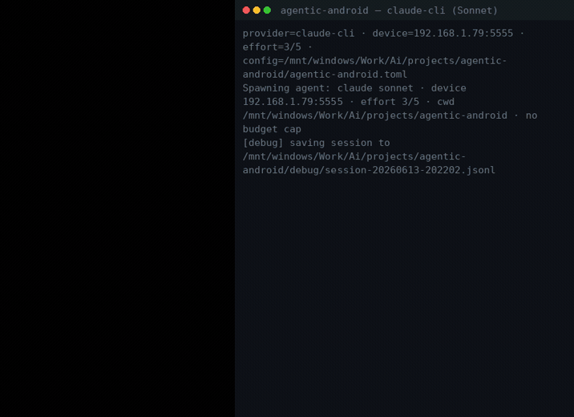

# Agentic Android

Control an Android phone or emulator with an LLM over ADB. The agent reads the
screen, picks an action (tap, swipe, type, launch an app), runs it through `adb`,
checks the result, and repeats until the task is done. No root, and nothing to
install on the device.

It works with Claude (via the `claude` CLI or the Anthropic API), OpenAI or any
OpenAI-compatible endpoint, and local models through Ollama or LM Studio.

<p align="center">
  
  <br>
  <em>The phone is on the left, the agent's console on the right. The task: install a wallpaper app from the Play Store and set a new wallpaper. It installs Zedge, corrects a wrong package name with <code>list_apps</code> (<code>com.zedge.android</code> → <code>net.zedge.android</code>), and when Zedge's preview returns a blank screenshot it switches to reading the UI tree with <code>dump_ui</code> to finish. Brain is the free <code>claude-cli</code>; no API key.</em>
  <br><br>
  <a href="assets/demo-wallpaper.mp4">MP4</a> (2.2 MB) · <a href="assets/demo-wallpaper.gif">GIF</a>
</p>

## What you can ask it

You give it a task the way you'd text a friend who's holding your phone, and it
works through the apps to do it:

- "Send a sweet good night text to my girlfriend"
- "Reply to Mom's last WhatsApp and tell her I'll call her tomorrow"
- "Install Spotify and play something chill"
- "Set an alarm for 6:30 and turn on Do Not Disturb until then"
- "Order my usual from the Starbucks app"
- "Book an Uber home"
- "Go through my notifications and tell me what actually needs a reply"
- "Find a butter chicken recipe and read me the ingredients"
- "Download a wallpaper app and set a new wallpaper" (the demo above)

It only sends, posts, buys, or signs in when you tell it to. For anything it can't
undo (a purchase, a 2FA code, a password) it stops and asks first, even at high
persistence. See [Persistence level](#persistence-level-05-and-cost) to tune how
much it does on its own before checking in.

## Providers

Set `provider` in `agentic-android.toml`.

| `provider`   | Backend | Needs |
|--------------|---------|-------|
| `claude-cli` | Your logged-in **Claude Code** CLI, run as a live chat | the `claude` CLI, no API key |
| `anthropic`  | Anthropic API | `ANTHROPIC_API_KEY` |
| `openai`     | OpenAI, or any OpenAI-compatible endpoint (OpenRouter, Azure, a local server) | `OPENAI_API_KEY` |
| `ollama`     | A local model via Ollama | nothing, runs on-device |
| `lmstudio`   | A local model via LM Studio | nothing, runs on-device |

The agent reads the screen one of two ways: as a screenshot (vision mode), or as
a text list of on-screen elements parsed from the UI tree (text mode). Text mode
is cheaper and faster and works with text-only models that can't see images. Both
are configured in `agentic-android.toml`.

## Requirements

1. A device: a phone with USB debugging on, or an emulator. A networked emulator
   works too (for example MuMu or an emulator VM at `192.168.1.79:5555`).
2. adb: the `adbutils` dependency ships a bundled binary, so you don't need to
   install adb yourself. A system `adb` on PATH is used if there is one. Check
   with `python -m agentic_android --list-devices`.
3. A brain. Pick one and set it in `agentic-android.toml`:
   - `claude-cli`: the `claude` CLI installed and logged in (run `claude` once).
     No API key. This is the default.
   - `anthropic`: an Anthropic API key.
   - `openai`: an OpenAI key, or any OpenAI-compatible endpoint via a custom base
     URL.
   - `ollama`: a local model, no key. Auto-detects the loaded model from
     `http://localhost:11434/v1`. The model needs tool calling (for example
     `qwen3`, `llama3.1`/`3.2`, `mistral-nemo`); vision models such as `qwen3-vl`
     or `llava` can set `vision = true`. Uses Ollama's native API so it can set a
     usable context window, since the 4096 default is too small.
   - `lmstudio`: a local model via LM Studio, no key. Start the server (Developer
     tab), load a tool-calling model (Gemma 4, Qwen, Llama 3.x), and it
     auto-detects it from `http://localhost:1234/v1`. Set a generous context
     length when you load the model.

## Install

Use the launcher. It creates its own virtualenv on first run, so it never touches
the system Python:

```bash
./run.sh --list-devices          # Linux/macOS
run.bat --list-devices           # Windows (or double-click run.bat)
```

`run.sh` and `run.bat` are wrappers around `python -m agentic_android`, so any
argument in this README works after them (for example
`./run.sh --provider openai "…"`).

To install manually instead:

```bash
cd /mnt/windows/Work/Ai/projects/agentic-android
python3 -m venv .venv
.venv/bin/pip install -e .        # or: pip install -r requirements.txt
.venv/bin/python -m agentic_android --list-devices
```

Use the venv's Python, not the system one. Running `python -m agentic_android`
with `/usr/bin/python` fails with "No module named agentic_android", because that
Python doesn't have the package. Use `./run.sh`, activate the venv
(`source .venv/bin/activate`), or call `.venv/bin/python` directly.

Pillow is optional. It only downscales large screenshots to cut token cost.
Without it (for example on Python 3.14 where wheels may be missing) the agent
sends full-resolution screenshots and still works.

## Configuration

Everything you'd tweak lives in `agentic-android.toml`, which is commented. The
three settings that matter most:

```toml
provider = "claude-cli"          # claude-cli | anthropic | openai | ollama | lmstudio

[device]
serial = "192.168.1.79:5555"     # your phone/emulator (see --list-devices)

[agent]
effort = 3                       # 0 = ask early and cheap … 5 = try everything
```

Then fill in the section for your provider. For an OpenAI-compatible server, point
`[openai].base_url` at it:

```toml
[openai]
api_key  = ""                            # or set env OPENAI_API_KEY
base_url = "https://api.openai.com/v1"   # OpenRouter, http://localhost:11434/v1, etc.
model    = "gpt-4o"                       # must be vision-capable for vision mode
```

Run with no arguments and it uses the config:

```bash
python -m agentic_android
```

## Reliability and diagnostics

A few things keep runs working outside a demo. They're on by default and tunable
in `[agent]`:

- Blank-screen fallback. Some app surfaces can't be screen-captured and come back
  black. The agent detects this (a dead capture is a tiny PNG) and reads the screen
  from the UI element list instead, so it keeps going rather than stalling.
- Wait-for-idle. After each action it waits for the screen to stop changing (up to
  `settle_timeout`) instead of a fixed delay, so it doesn't act on a half-loaded screen.
- Retries and timeouts. Transient `adb` failures (a dropped network device) are
  retried with backoff and a reconnect; LLM calls have a timeout so a stalled
  connection can't hang the run.
- Confirmation gate (opt-in). Set `confirm_destructive = true` (or pass
  `--confirm-destructive`) and the agent stops for a `y/N` before high-risk actions:
  uninstall, buy/pay, delete, factory reset, sign out.

Run a preflight check anytime:

```bash
python -m agentic_android --doctor
```
```
Agentic Android — preflight doctor
  provider=ollama · device=192.168.1.79:5555

  [PASS] adb            bundled adbutils binary
  [PASS] device         192.168.1.79:5555 connected
  [PASS] screenshot     1080x2400 PNG, non-blank
  [FAIL] ollama server  no response from http://localhost:11434/v1
           → Start `ollama serve`.
```

The same checks run automatically before each task (skip with `--no-preflight`), so
setup problems show up as a clear message instead of a cryptic error. If exactly one
device is attached it's selected automatically, so `--serial` is optional.

## Usage

### Live chat through the `claude` CLI (no API key)

This is the default. It spawns a headless `claude` agent using your logged-in
Claude Code subscription (no `ANTHROPIC_API_KEY`), connects the device tools over
MCP, and relays your terminal to and from the agent. You type, it acts, and you
can keep typing to steer it while it works.

```bash
python -m agentic_android --chat -s 192.168.1.79:5555
```
```
you> Install WhatsApp on my phone
   · screenshot {}
agent> Opening the Play Store and searching for WhatsApp.
   · launch_app {"package":"com.android.vending"}
   · tap {"x":360,"y":140}
   · type_text {"text":"WhatsApp"}
   ...
agent> WhatsApp is installing. I'll tell you when it's done.
you> also install Telegram while you're at it          # steer mid-task
```

Chat needs the `claude` CLI installed and logged in (run `claude` once). Options:
`--model sonnet|haiku|opus` (default `sonnet`), `--budget 2` for a USD cap (passed
to `claude --max-budget-usd`). The agent runs with its working directory set to
this project, so its Claude Code session history stays separate from other
projects.

### How it works: the MCP device server

The interesting part of the `claude-cli` path is that the agent is just Claude
Code, with your phone handed to it as tools over
[MCP](https://modelcontextprotocol.io) (the Model Context Protocol). You reuse
Claude Code's whole agent loop — planning, tool use, recovery — pointed at a phone,
running on your existing Claude subscription, so there's no `ANTHROPIC_API_KEY` and
no per-token bill.

When you run `--chat`, `chat.py` does three things:

1. Writes a temporary MCP config that points at `python -m agentic_android.mcp_server`,
   a small [FastMCP](https://modelcontextprotocol.io) server that talks over stdio.
   The device serial, adb path, and the reliability settings are passed to it as
   environment variables.
2. Spawns the headless agent with that server attached:
   ```
   claude -p --input-format stream-json --output-format stream-json \
     --permission-mode bypassPermissions \
     --allowedTools ToolSearch,mcp__agentic_android \
     --mcp-config <tmp.json> --strict-mcp-config \
     --append-system-prompt "<device rules>" --model sonnet
   ```
3. Relays both directions. It prints the agent's stream-json events (its text and
   each tool call) as they arrive, and feeds whatever you type back in as a user
   message — so you can steer mid-task without stopping it.

The server (`agentic_android/mcp_server.py`) exposes the device as MCP tools:
`screenshot`, `tap`, `tap_element`, `swipe`, `type_text`, `press_key`,
`launch_app`, `list_apps`, and `dump_ui`. Every screen-changing tool returns a
fresh screenshot in its result, so the agent sees the effect of each action (the
computer-use loop). If a capture comes back blank/black, it returns the UI element
list instead, so a protected surface can't blind it.

Why this is nice:

- No API key and no token bill — it rides your logged-in Claude Code.
- You get the whole agent for free. Claude Code already knows how to plan, retry,
  and chain tools, so the device code stays small: it only has to expose adb.
- MCP is portable. `agentic_android` is a standard MCP server, so any MCP client
  (Claude Desktop, another agent) can attach it and drive the phone too — nothing
  is tied to this CLI.
- It's genuinely multimodal: the tools hand back real screenshots, not just text.
- It's isolated and autonomous. It runs in this project's directory (its own
  Claude Code session history), under `bypassPermissions` so it doesn't prompt on
  every tap, with `--strict-mcp-config` so only your device server is loaded.

### Persistence level (0–5) and cost

When the agent gets stuck or hits an ambiguous choice, it asks you a question with
options instead of guessing. How hard it tries to recover on its own before asking
is the persistence level, 0 to 5, set in `agentic-android.toml` or with
`--effort N`:

| Level | Behaviour |
|------:|-----------|
| 0 | Ask at the first ambiguity or failure; almost no self-recovery |
| 1 | One quick retry, then ask |
| 2 | A couple of recovery attempts, then ask |
| 3 | Default. Several strategies (re-screenshot, `dump_ui`, scroll, alternate path) before asking |
| 4 | Exhausts visual and UI-tree approaches; asks only when truly blocked |
| 5 | Tries everything; asks only for what it can't resolve (passwords, 2FA, purchase confirmation) |

Higher levels make more screenshots, tool calls, and model turns before the agent
pauses, so they cost more. Lower levels check in sooner and spend less.

```bash
python -m agentic_android --chat -s 192.168.1.79:5555 --effort 4   # try hard before asking
python -m agentic_android --chat -s 192.168.1.79:5555 --effort 0   # ask early, spend little
```

When it asks in chat, type your answer (a number or free text) and it continues.
The API-agent path uses an `ask_user` tool that prompts in the terminal.

### API agent (`anthropic` or `openai`)

Set `provider` to `anthropic` or `openai` in the config or with `--provider`. The
loop is provider-agnostic: it keeps one ongoing conversation, sends a fresh
screenshot with each message, and acts. `ask_user` lets it ask a question with
options when stuck.

```bash
# OpenAI, or any OpenAI-compatible endpoint (note the custom --base-url)
python -m agentic_android --provider openai "Open Settings and turn on Airplane mode"
python -m agentic_android --provider openai                  # interactive chat

# Local models, no key (auto-detects the loaded model)
./run.sh --provider ollama "Open the Chrome browser app"
./run.sh --provider lmstudio "Open the Chrome browser app"

# Anthropic
python -m agentic_android --provider anthropic --model claude-opus-4-8
```

Keys come from the config file or the environment (`OPENAI_API_KEY`,
`ANTHROPIC_API_KEY`). Example tasks: "Open the Clock app and set an alarm for 7:30
AM", "In Settings, find the Android version".

### Text mode (for models that can't see screenshots)

Many models, including most local and text-only ones, can't read images. Set
`vision = false` (or pass `--no-vision`) and the agent stops sending screenshots.
Instead it describes the screen as a numbered list of on-screen elements parsed
from the Android UI tree, each with a tap point:

```
Screen 720x1280px — 45 elements. Tap with the @(x,y) point.
#1 [ImageView] "Back" @(48,57) [tap]
#4 [ImageView] "Open notification settings" @(560,57) [tap]
#9 [View] "1,380 posts" id=profile_header_post_count @(298,236) [tap]
#20 [EditText] "Search" id=search_input @(360,140) [tap,input]
```

The model taps the `@(x,y)` of the element it wants (coordinates are real device
pixels). Enable it per provider:

```toml
[openai]
model  = "llama3.2-vision"   # or any text model
vision = false
```
```bash
python -m agentic_android --provider openai --base-url http://localhost:11434/v1 --no-vision
```

Vision is still better when the model supports it. Text mode is the fallback that
makes non-vision models usable.

### Skills: learn once, run free

Record a task the first time (the LLM does it) and the steps are saved as a
deterministic, self-healing skill. Replaying it drives the device with no LLM calls;
if the UI changed, it repairs just the affected step and updates the skill.

```bash
# record (needs an API provider — the controllable loop)
python -m agentic_android --provider openai --record "open the Clock app and start a timer" --as timer
python -m agentic_android --run-skill timer      # replay, ~zero LLM cost
python -m agentic_android --skills               # list saved skills
```

Skills live in `data/skills/<name>.json` (git-ignored). On replay the agent first
tries a mined `am start` shortcut to jump past navigation, then runs each step,
verifying it against the screen it expected; a step that no longer matches is healed
with one LLM call and the fix is written back, so the cost is paid once per change,
not every run. You can also turn a `--chat` session's debug log into a skill with
`--import-trace debug/session-*.jsonl`. Secrets typed into password/OTP fields are
never stored — those steps are marked for a live rerun instead.

### Guardrails and self-verifying tasks

Give a task rules it must respect and a success condition to verify. Deterministic
rules are checked from the UI tree after every step (free); a natural-language
success/forbidden check is judged by the model at the end (and optionally every N
steps with `--judge-frequency`).

```bash
python -m agentic_android --provider openai "open my cart and check the total" \
  --stay-in-app com.amazon.mShop.android.shopping \
  --forbid "Buy now" --forbid "Place order" \
  --assert "the cart total is shown and no order was placed" \
  --on-violation rewind
```

On a violation it stops (default), rewinds toward the last good screen and tries
another path (`--on-violation rewind`), or asks you (`ask`). At the end it prints a
verdict (which rules held, whether success was verified) and exits non-zero (code 3)
if a guardrail failed — useful in scripts. Rules can also live in a file:
`--guardrails task.toml`. On the `claude-cli` path the rules are enforced as a
device-level block on forbidden taps plus instructions in the agent's prompt; the API
providers enforce them in the loop.

### A nicer CLI (styled output + inline screenshots)

With `rich` installed (`pip install rich`, or the `ui` / `full` extra) the chat gets a
status bar, panels, and colored tool calls. In a terminal that supports inline images
(kitty, iTerm2) it also draws the phone screen after each action; elsewhere it falls
back to text. Control it with `--ui auto|rich|plain` and `--inline-screen auto|on|off`
(or the `[ui]` section). Piped or redirected output is always plain with no image
escapes, so recordings and logs stay clean.

## Debugging

Add `--debug` (or `[agent] debug = true`) to save every API request and response
for the run to `debug/session-<timestamp>.jsonl`, one JSON object per line:

```bash
./run.sh --provider openai --no-vision --debug "Open the Clock app"
```

- For `anthropic` and `openai`: each request (model, messages, tools) and its
  response, including token `usage`. Base64 screenshots are redacted to a size
  marker so the file stays readable; the text element list is kept as-is.
- For `claude-cli`: the agent's full raw stream-json (every tool call, result, and
  message).

`debug/` is git-ignored. Use `--debug-dir <path>` to change where it's written.

## Layout

| File | Role |
|------|------|
| `agentic_android/adb.py` | Thin adb wrapper: screencap, input tap/swipe/text/key, uiautomator dump, app launch. |
| `agentic_android/device.py` | Screenshot capture with optional downscaling; maps image coordinates back to real device pixels. |
| `agentic_android/mcp_server.py` | MCP stdio server exposing the device tools (used by the `claude-cli` provider). |
| `agentic_android/chat.py` | Spawns a `claude` CLI agent with the MCP server attached and relays the terminal chat. |
| `agentic_android/brains.py` | Provider backends (`AnthropicBrain`, `OpenAIBrain`, `OllamaBrain`) behind one interface. |
| `agentic_android/agent.py` | Provider-agnostic agent loop; one-shot `run()` and interactive `chat()`. |
| `agentic_android/tools.py` | Tool schemas (converted to OpenAI function format by `brains.py`). |
| `agentic_android/config.py` | Loads `agentic-android.toml` and the persistence-level text. |
| `agentic_android/doctor.py` | Preflight checks (`--doctor`), device auto-detection, provider reachability. |
| `agentic_android/skills.py` | Record / replay / self-heal skills (learn once, run free). |
| `agentic_android/guardrails.py` | Forbidden-state + success-assertion checks, verdict, rewind. |
| `agentic_android/ui.py` | Styled CLI output + inline screenshots (optional `rich`). |
| `agentic_android/__main__.py` | CLI: provider, device, and dispatch. |

The API agent defaults to `claude-opus-4-8`. Coordinates the model returns are in
the shown image's pixel space; `Device.scale` converts them to physical pixels so
taps land correctly even when screenshots are downscaled.

## Notes and limits

- `type_text` goes through `adb shell input text`. It escapes common characters
  but works best with plain ASCII. For unusual unicode, use an on-screen keyboard
  or a per-app text method.
- This automates whatever device you point it at. Review a task before running a
  destructive one, and turn on `confirm_destructive` to be prompted before
  high-risk actions (uninstall, buy, delete, factory reset, sign out).
- One action set per step keeps the loop readable. Raise `--max-steps` for longer
  flows.

## Possible additions

- `scroll_to_text` / `tap_text` helpers built on `dump_ui` for steadier targeting.
- A persistent navigation graph for fast cross-app routing; multi-device fan-out.
- Trigger/watch mode (act when a notification or screen condition fires).

## License

MIT. See [LICENSE](LICENSE). Copyright (c) 2026 Bhavik Patel.
